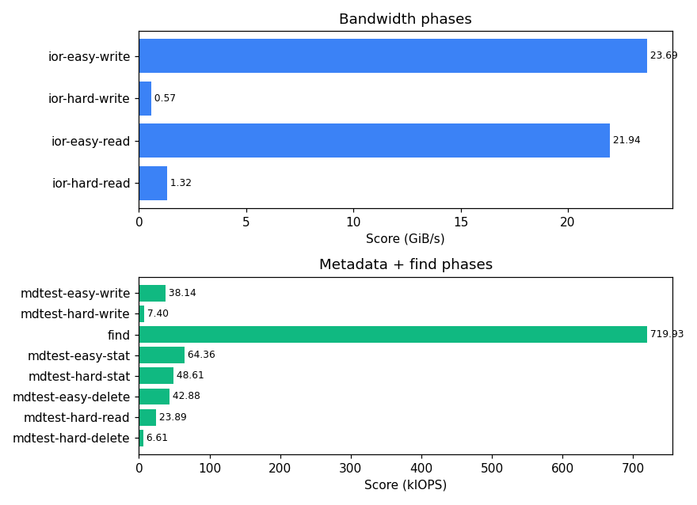

# IO500 Run Report — `pre-maint`

| Field | Value |
|---|---|
| Benchmark timestamp (UTC) | `20260518T152012Z` |
| Label | `pre-maint` |
| Config | `/home/acchapm1/io/asu-io500/configs/asu-beegfs.ini` |
| Slurm job | `53011530` |
| Launch host | `sc071` |
| Nodes | 10 (`sc[071-080]`) |
| Ranks | 80 (8 per node) |

## Phase Results

```
┌────────────────────┬──────────────────┬───────────┐
│ Phase              │ Score            │ Time      │
├────────────────────┼──────────────────┼───────────┤
│ ior-easy-write     │ 23.687935 GiB/s  │ 739.905 s │
│ mdtest-easy-write  │ 38.139993 kIOPS  │ 670.869 s │
│ ior-hard-write     │ 0.568578 GiB/s   │ 812.956 s │
│ mdtest-hard-write  │ 7.396336 kIOPS   │ 308.282 s │
│ find               │ 719.930943 kIOPS │ 38.576 s  │
│ ior-easy-read      │ 21.943803 GiB/s  │ 798.094 s │
│ mdtest-easy-stat   │ 64.363341 kIOPS  │ 397.489 s │
│ ior-hard-read      │ 1.320218 GiB/s   │ 350.188 s │
│ mdtest-hard-stat   │ 48.614078 kIOPS  │ 47.791 s  │
│ mdtest-easy-delete │ 42.882619 kIOPS  │ 620.362 s │
│ mdtest-hard-read   │ 23.889776 kIOPS  │ 96.101 s  │
│ mdtest-hard-delete │ 6.610496 kIOPS   │ 349.272 s │
└────────────────────┴──────────────────┴───────────┘
```

**Final:** `[SCORE ] Bandwidth 4.444457 GiB/s : IOPS 37.951332 kiops : TOTAL 12.987419`

## Run Analysis

Final score: **TOTAL 12.987** (Bandwidth 4.444 GiB/s, IOPS 37.951 kIOPS). The TOTAL is the geometric mean of the bandwidth and IOPS legs, so neither side can be hidden by the other.

Across 10 nodes / 80 ranks, the run spent ~5230 s of phase time total, dominated by `ior-hard-write` (0.569 GiB/s, 813 s) at 16% of that. Easy/hard write bandwidth ratio is 42× (23.69 vs 0.57 GiB/s), so 47008-byte transfers cost roughly 42× more per byte than 2 MiB transfers on this filesystem. 

Several read/stat/delete phases finished well under the 300 s stonewall — `mdtest-hard-stat` (48.614 kIOPS, 48 s), `mdtest-hard-read` (23.890 kIOPS, 96 s). These hit the dataset size cap (`n` / `segmentCount` / `blockSize`) instead of the time cap, so their scores are bounded by how much data the preceding write phase laid down.




## Suggested Improvements

- **Investigate ior-hard write bottleneck** — only 0.57 GiB/s on 47008-byte transfers, vs 23.69 GiB/s on 2 MiB transfers (`ior-easy`). Try a larger BeeGFS `chunksize`, raise the stripe count for the ior-hard datadir with `beegfs-ctl --setpattern`, or investigate small-IO coalescing on the OSS side.
- **Add BeeGFS metadata targets** — `mdtest-hard-write` is 7.40 kIOPS vs `mdtest-easy-write` at 38.14 kIOPS (a 5× gap). Shared-directory metadata typically scales with the number of metadata targets; the easy/hard gap is the classic sign that the hard phase is funneling through too few MDTs.
- **Raise dataset-size knobs for count-limited phases** — these phases finished well under the 300 s stonewall and so were capped by dataset size, not time: `mdtest-hard-stat` (48 s, knob: `[mdtest-hard] n`), `mdtest-hard-read` (96 s, knob: `[mdtest-hard] n`). Bumping the matching `n` / `segmentCount` / `blockSize` lets stonewall do its job and gives a more honest score. Remember: a change here invalidates pre-vs-post comparability, so re-run **both** halves.
- **Capture per-phase OSS/MDS utilization** — none of the existing result files include filesystem-side counters. Wrap the next run with a `beegfs-ctl --serverstats` poller or `sar -d` on each OSS so we can tell whether a poor score is the client side or the storage side.

_(Heuristic analysis — generated by `scripts/generate-report.py`, no LLM in the loop.)_

